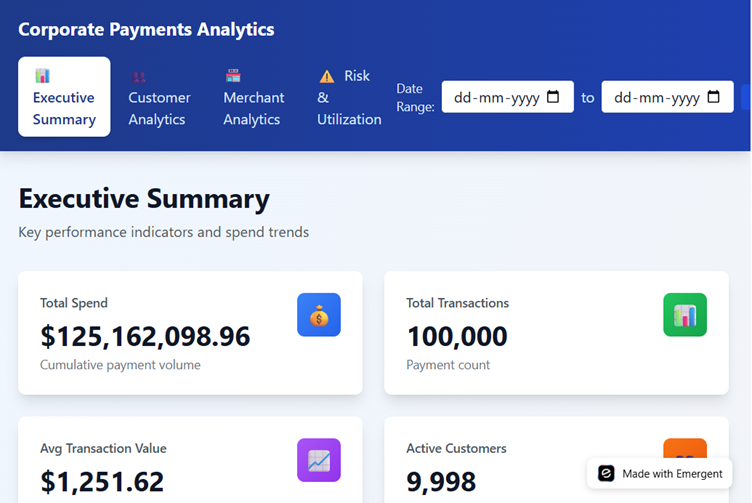
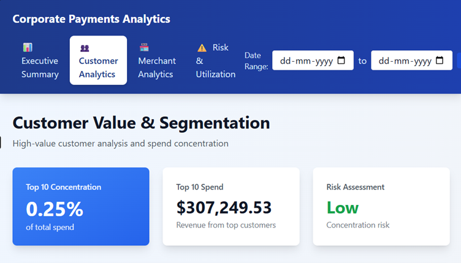
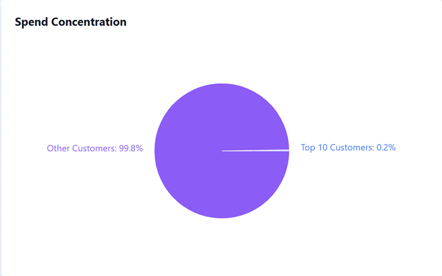
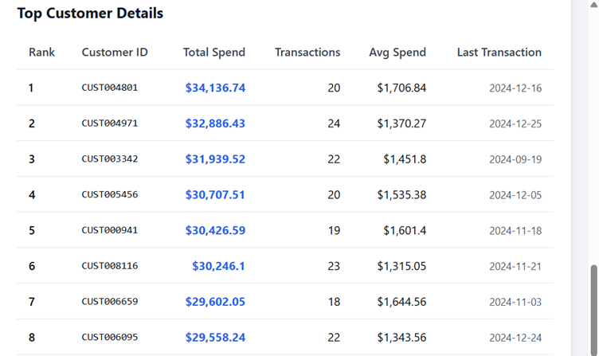
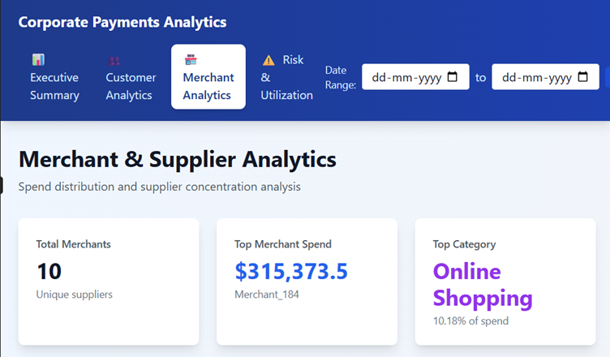
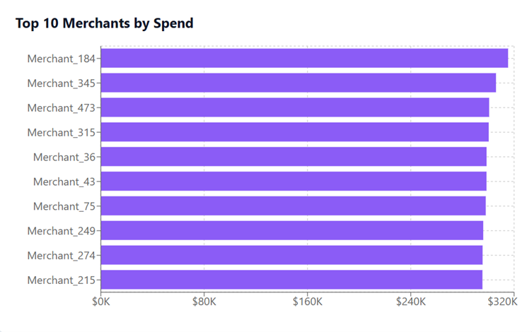
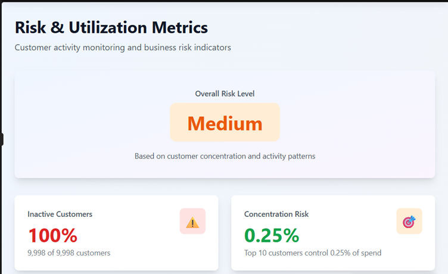
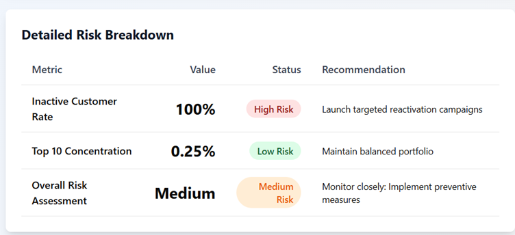

# Corporate Payments & Spend Analytics Dashboard

This project analyzes a large-scale credit card transaction dataset to produce
enterprise-level insights on customer spend, merchant concentration, and portfolio risk.

## Business Objective
Commercial payments teams need visibility into:
- Where money is being spent
- Which customers drive revenue
- Which merchants dominate payments
- Which accounts are inactive or risky

This dashboard provides those insights in an executive-ready format.

## Key KPIs
- Total Spend  
- Total Transactions  
- Average Transaction Value  
- Active Customers  
- Monthly Spend Trend  
- Top Customer Spend Contribution %  
- Merchant Concentration %  
- Inactive Account %  

## Tools Used
- SQL for transaction analysis  
- BI dashboards for visualization  
- Enterprise KPI design  

## Executive Summary

## Customer Analytics

## Merchant & Category Analytics

## Risk & Utilization

